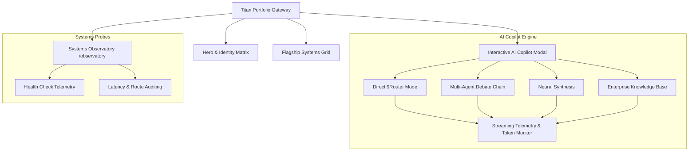

# 🌌 Olyx Titan Portfolio — Chief Systems Architect & AI Engineering Showcase

<p align="center">
  
  
  
  
  
  
  
</p>

> 🚀 **Live Production Application:** [https://olyxmintabansos-byte.github.io/olyx-portfolio/](https://olyxmintabansos-byte.github.io/olyx-portfolio/)

---

### 🌐 System Overview & Vision

**Olyx Titan Portfolio** adalah portfolio interaktif tingkat enterprise yang mendemonstrasikan kapabilitas rekayasa perangkat lunak berskala besar dari **Olyx (@olyxmintabansos-byte)** — Chief Systems Architect & Master Full-Stack Engineer.

Bukan sekadar situs statis konvensional, platform ini dirancang sebagai *Interactive Systems Hub* lengkap dengan:
1. **Interactive AI Copilot Suite:** Asisten kognitif cerdas dengan orkestrasi *Multi-Agent Dialectical Reasoning*, telemetri pembakaran token real-time, dan bridge streaming AI router lokal.
2. **Flagship Systems Matrix:** Showcase komprehensif 18+ aplikasi web enterprise tanpa ketergantungan server runtime (**Client-Side Local-First**).
3. **Systems Health Observatory (`/observatory`):** Telemetri pemantauan status hidup (*live health probes*), latensi respon (*ms*), dan tingkat ketersediaan (*uptime*) dari setiap aplikasi ekosistem Olyx.

---

### 🌟 Key Functional Pillars

#### 1. 🤖 Interactive AI Copilot (`AICopilotModal`)
- **Multi-Modal Reasoning Engine:**
  - **Direct Router:** Respon kilat dengan optimasi latensi untuk pertanyaan teknis spesifik.
  - **Multi-Agent Debate:** Simulasi debat adversarial antara agen *Architect* vs *Auditor* vs *Synthesizer*.
  - **Neural Synthesis:** Rekomendasi solusi arsitektur menyeluruh dengan trade-off mendalam.
  - **Enterprise Knowledge:** Basis pengetahuan komprehensif mengenai seluruh repositori, stack teknologi, dan filosofi rekayasa Olyx.
- **Streaming Telemetry Metrics:** Menampilkan *Prompt Tokens*, *Completion Tokens*, *Total Tokens*, dan *Latency (ms)* secara transparan pada setiap dialog.

#### 2. ⚡ Flagship Systems Showcase (`/`)
- **Direct Live Demos:** Akses langsung ke aplikasi produksi:
  - 🧠 **NeuroForge AI:** Multi-Agent Consensus & Adversarial Debate Studio.
  - ⚡ **Nexus ShiftOps:** 24/7 Workforce Shift Roster, Payroll & Fleet Logistics OS.
  - 🎓 **EduCore OS:** School OS, Anti-Cheat CBT Exam Simulator & Raport A4.
  - 🏢 **SimuCorp OS:** Cyberpunk Corporate Tycoon & High-Frequency Stock Exchange.
  - ☕ **OmniPOS OS:** Retail & F&B Cashier Terminal with Kitchen Display (KDS).
  - 📄 **CraftCV AI:** ATS Resume Architect & AI Interview Simulator.
  - 💳 **FinPulse AI:** Corporate Financial Intelligence & Virtual CFO Engine.
- **Direct Code Repository Links:** Akses cepat ke source code open-source di GitHub.

#### 3. 📡 Systems Health Observatory (`/observatory`)
- **Live Health Probes:** Pelacakan otomatis status operasional setiap modul sistem (*OPERATIONAL / ONLINE*).
- **Latency Telemetry:** Indikator visual performa respon runtime browser.
- **Uptime Matrix:** Verifikasi ketersediaan aplikasi web tanpa dependensi server mati.

---

### 🏗️ Architecture & Component Topology



---

### 📁 Directory Layout

```
olyx-portfolio/
├── public/
│   └── .nojekyll                 # Jekyll bypass for GitHub Pages
├── src/
│   ├── app/
│   │   ├── observatory/page.tsx  # Systems health & telemetry monitor
│   │   ├── layout.tsx            # Global layout, fonts & cybernetic theme
│   │   └── page.tsx              # Titan showcase & flagship applications
│   ├── components/
│   │   └── AICopilotModal.tsx    # Multi-agent AI copilot dialog & streaming
│   ├── lib/
│   │   ├── router-bridge.ts      # Local AI router bridge & fallback logic
│   │   └── utils.ts              # Styling & format utilities
│   └── types/
│       └── portfolio.ts          # Project schemas, telemetry & chat interfaces
├── next.config.ts                # Static export configuration
└── package.json                  # Dependencies & scripts
```

---

### 🛠️ Technology Stack

| Domain | Technology / Library | Rationale |
|---|---|---|
| **Framework** | Next.js 16 (App Router) | Cutting-edge Turbopack static generation |
| **Language** | TypeScript (Strict Mode) | Zero build/type errors guaranteed across all interfaces |
| **Styling** | Tailwind CSS v4 | High-performance CSS-first zero-runtime utility styling |
| **Icons & UI** | Lucide React | Clean, scalable vector iconography |
| **Streaming & AI** | Fetch Stream API | Real-time token streaming and prompt telemetry |
| **Deployment** | GitHub Pages (`gh-pages`) | Static hosting with `.nojekyll` bypass |

---

### 🚀 Getting Started & Local Development

Clone repositori dan jalankan pada local development environment:

```bash
# 1. Clone repository
git clone https://github.com/olyxmintabansos-byte/olyx-portfolio.git
cd olyx-portfolio

# 2. Install dependencies
npm install

# 3. Jalankan development server
npm run dev
```

Buka [http://localhost:3000](http://localhost:3000) pada browser Anda.

#### Build & Static Export

```bash
# Build static export ke direktori out/
npm run build

# Deploy langsung ke GitHub Pages branch gh-pages
npx --yes gh-pages -d out -b gh-pages --dotfiles
```

---

### 📄 License & Attribution

Didistribusikan di bawah lisensi MIT. Silakan gunakan untuk keperluan komersial maupun edukasi.

<p align="center">
  
  
</p>

<p align="center">
  <strong>© 2026 by Olyx (@olyxmintabansos-byte)</strong> • All rights reserved.
</p>
